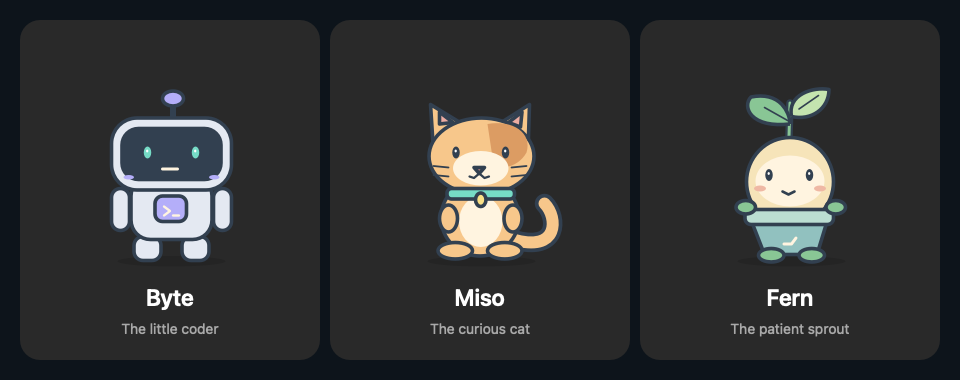
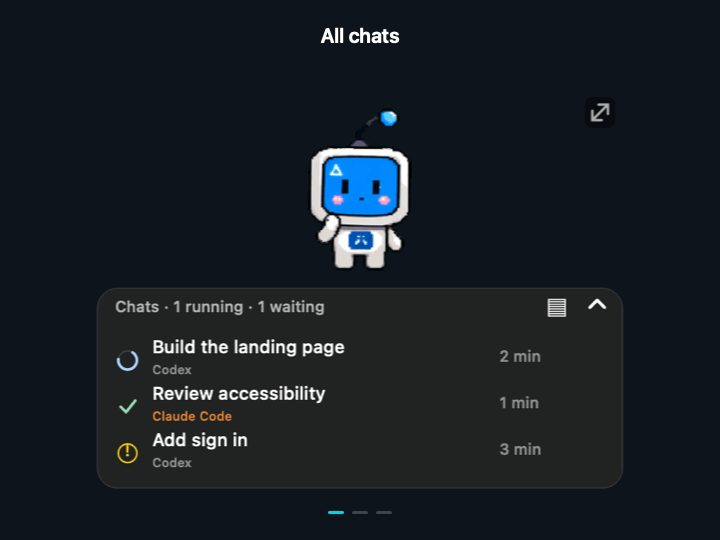
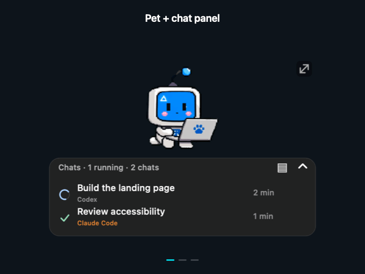

# Agent Pet

**Your coding chats, at a glance.**

A floating desktop companion for **Codex and Claude Code in VS Code**. 
See what’s running, finished, or waiting for you—even while using another app.

**macOS 26+ · Apple Silicon · English / Türkçe**

[**Download**](https://github.com/merttalhayener/agent-pet/releases) · [Türkçe](README.tr.md) · [Changelog](CHANGELOG.md)

## Meet your companions

**Byte** the robot, **Miso** the cat, and **Fern** the sprout. Three original, animated characters included with Agent Pet. Choose one from **Pets**; no artwork from other extensions is used.

## See when a chat needs you

Watch a chat move from **running → waiting for your reply → completed**. Each conversation keeps its own status and elapsed time.

## Keep projects separate

Click **▤** to group chats by workspace. Fold a group to make room; click a chat to return to its VS Code window.

## Keep the panel, hide the pet

Choose **Hide pet** for fewer distractions. Your chats stay visible; **Show pet** brings the character back. **Hide panel** hides only the chat list, leaving the pet visible. **Hide all** hides both. **Appearance → Panel only** controls the same character preference.

*Animations use sample conversations rendered by the app.*

Supports **local VS Code sessions**. CLI-only and cloud-only sessions are not supported. VS Code must stay open for live updates. No API keys or hooks to configure.

## Stay focused

- **Filters:** show all chats, running chats, or those waiting for you; narrow to one workspace.
- **Workspace overrides:** right-click a chat → **Assign workspace** to choose its group and destination window.
- **Clear statuses:** optional text explains the icons, including **Stopped** and **No update**.
- **Waiting notifications:** opt in under **Notifications**; click a macOS banner to return to the chat. Mute individual chats.
- **Menu bar counter:** see running and waiting totals even with the panel hidden.
- **Updates:** Marketplace installations use VS Code’s extension updates. **Check for updates…** opens the extension’s store entry.

## Install

Install Agent Pet from the [VS Code Marketplace](https://marketplace.visualstudio.com/items?itemName=merttalhayener.agent-pet). Version **0.14.0** includes only original characters; the regular-release package is ready and Marketplace upload is pending.

1. Install **Codex**, **Claude Code**, or both in VS Code and sign in.
2. Open Extensions, search `@id:merttalhayener.agent-pet`, and install Agent Pet.
3. Run **Agent Pet: Show Desktop Pet** from the Command Palette.

**Coming from the GitHub preview?** Choose **Replace preview**, let active chats finish, then run **Developer: Reload Window** in each VS Code window. Pet preferences are kept. The older `local.codex-pet-panel` and new Marketplace extension have different identities, so this is a one-time migration.

Subsequent Marketplace updates use VS Code’s update settings. From 0.11.4, the running desktop panel switches to the newly installed helper within a few seconds, keeping visibility preferences and active chats. The first upgrade from an older version needs a window reload to enable this mechanism. Agent Pet can reload each window after tracked chats finish and changes are saved, with a 15-second **Later** option. Disable this with `codexPet.autoReloadAfterUpdate` if you prefer manual reloads.

The macOS app is bundled inside the extension; there is no separate Applications-folder installation. From 0.14.1, removing the last installed copy closes its panel automatically. Closing all connected VS Code windows also closes the helper after a short reconnect grace period (about one minute). VS Code removes the bundled app files during extension cleanup, which may require restarting VS Code.

## Quick controls

| Want to… | Do this |
| --- | --- |
| Hide the character | **Hide pet** (restore with **Show pet**) |
| Group chats | Click **▤**, or **Appearance → Extended · Workspaces** |
| Move / resize | Drag the pet or panel header / drag the top-right handle |
| Hide or restore the chat list | **Hide panel / Show panel** |
| Hide or restore everything | **Hide all / Show all**, or **Ctrl + Option + Cmd + P** |
| Reopen / change language | VS Code’s **Agent Pet** button / **Language** menu |

Right-click the pet or panel for settings. Your preferences are remembered.

Independent community project. No added telemetry; chat records stay local. Marketplace downloads and update checks are managed by VS Code. Waiting notifications require macOS permission.

[Usage & troubleshooting](docs/usage.md) · [Build & technical details](docs/development.md) · [Report an issue](https://github.com/merttalhayener/agent-pet/issues)

## License

Original source code, Byte, Miso, Fern, and the application icon are [MIT licensed](LICENSE). No external character artwork is loaded or bundled. Codex and Claude Code names identify supported integrations; Agent Pet is an independent community project.
