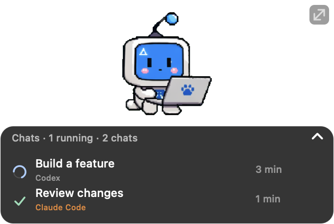
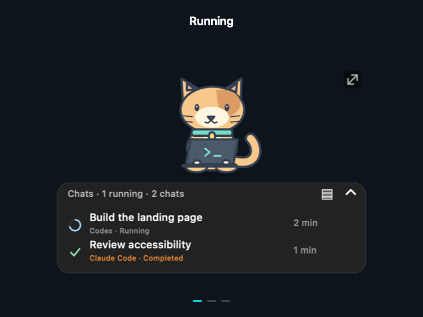
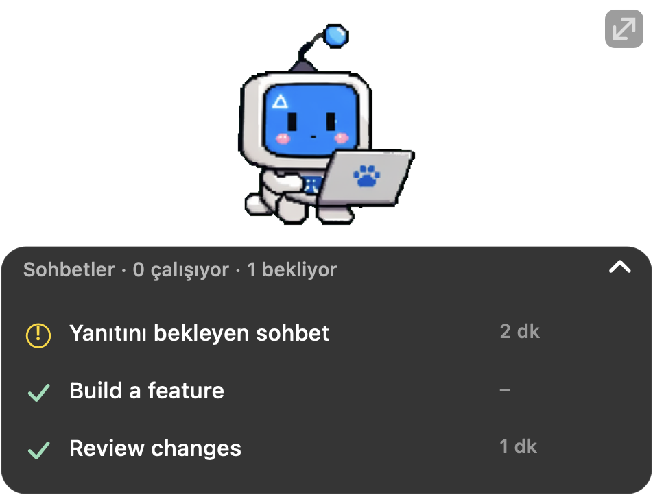

# Agent Pet

**Your coding agents, at a glance.**

A desktop pet that shows what's running, what's finished, and which chat needs you.

**[Download for macOS](https://github.com/merttalhayener/agent-pet/releases/tag/v0.7.1)** · [Türkçe](README.tr.md) · [Changelog](CHANGELOG.md)

## One pet. All your tracked chats.

Keep working in another app while Agent Pet follows your local conversations. Click a chat to return to it in VS Code. Finished chats stay until you dismiss them. Each row identifies **Codex** or **Claude Code**.

| See the state | Make it yours | Stay focused |
| --- | --- | --- |
| 🔵 Running · ✅ Done · 🟡 Needs a reply | Choose a pet, resize it, adjust text and opacity | Collapse the list or pin important chats |
| Elapsed time for each turn | Move freely or snap to a screen edge | Completion animation and optional sound |

<table>
<tr>
<td align="center" width="50%"><strong>Small when you need space</strong>  </td>
<td align="center" width="50%"><strong>Know when a chat needs you</strong>  </td>
</tr>
</table>

**Presenting or sharing your screen?** Press **Ctrl + Option + Cmd + P** to hide the pet and mute feedback. Press it again to restore, or use the menu bar paw icon.

## What is supported?

| | Available now |
| --- | --- |
| **Operating system** | macOS 26+ on Apple Silicon |
| **Agents** | Codex and Claude Code in VS Code |
| **CLI-only / cloud-only sessions** | Not supported in this release |
| **Other platforms** | Not supported yet |

**English is the default interface language; Turkish is also available.** VS Code must remain running for live updates. Agent Pet is an independent community project.

Claude Code support reads local VS Code session files automatically; no hooks or API keys need to be configured. Clicking a Claude row opens that session in the right sidebar. A completed editor tab can be moved automatically; finish and close an active editor tab before opening it from the pet again.

## Get started

1. Install **Codex**, **Claude Code**, or both in VS Code and sign in. Codex is optional.
2. [Download **agent-pet-0.7.1.vsix**](https://github.com/merttalhayener/agent-pet/releases/download/v0.7.1/agent-pet-0.7.1.vsix).
3. In VS Code: **Extensions → ⋯ → Install from VSIX…** → select the file.
4. Run **Agent Pet: Show Desktop Pet** from the Command Palette.

**Click a row** to open a chat. **Drag the pet** to move it. **Drag ↗↙** to resize. **Right-click** for settings. Use the list's chevron to collapse or expand.

### Language

Use the paw menu or right-click the pet → **Language → English / Türkçe**. The desktop interface changes immediately and remembers your choice after restart. Existing installations also start in English until a language is selected. Conversation titles keep their original text.

### Closed the pet?

Click **Agent Pet** in VS Code's bottom status bar to bring it back. You can also press **Cmd + Shift + P** and run **Agent Pet: Show Desktop Pet**.

Closing the floating pet keeps the macOS menu bar paw available: choose **Show pet**, or press **Ctrl + Option + Cmd + P**. If the helper has quit completely, use the VS Code button or command.

### A chat looks stuck after reload?

Agent Pet waits for a new activity record before showing a reattached chat as running. After 60 seconds without progress, its spinner becomes **No update**. The row stays visible and resumes automatically when new activity arrives. Only an explicit completion record produces a checkmark. Previously tracked chats are rechecked after restart, including older completion records, so a completed chat does not stay stuck on `?`.

This tracks local agent activity; it cannot tell whether the agent chat UI is receiving messages. A quiet long-running tool can also show “no update.”

Upgrading? Once active turns finish, run **Developer: Reload Window** once to load the new chat navigation. The desktop helper updates automatically and your preferences are kept.

<strong>Beta notes & local data</strong>

- Tracks recent local conversations in the open workspace, not every open tab or cloud-only chat.
- Pending questions are detected from local records; some permission dialogs cannot be detected.
- No telemetry is added and no chat records are sent to a server by this extension. An included vector robot works without Codex. Optional character artwork comes from your installed Codex extension.
- Developer ID signing/notarization and a general open-source license are not yet provided.

**[Build & technical details](docs/development.md)** · **[Report an issue](https://github.com/merttalhayener/agent-pet/issues)**
