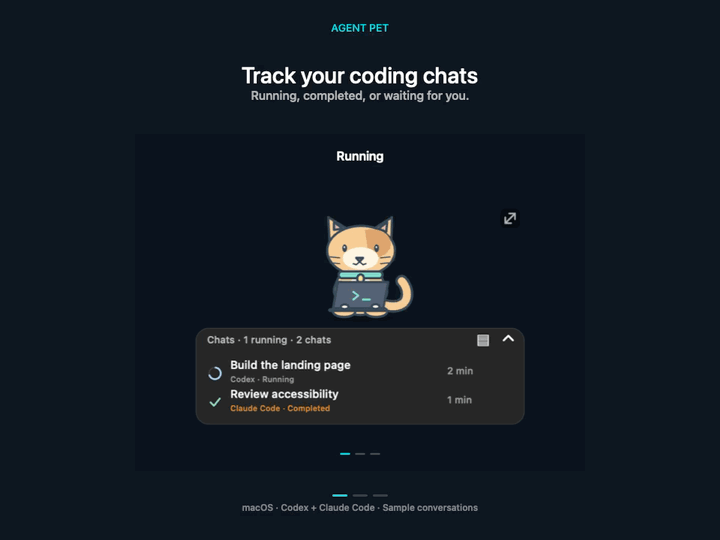

# Agent Pet

**Your coding chats, at a glance.**

A floating desktop companion for **Codex and Claude Code in VS Code**. 
See what’s running, finished, or waiting for you—even while using another app.

[**Install from the Marketplace**](https://marketplace.visualstudio.com/items?itemName=merttalhayener.agent-pet) · [Türkçe](README.tr.md) · [Changelog](CHANGELOG.md)

**Requires** macOS 26+ on Apple Silicon · local VS Code sessions (not CLI-only or cloud-only) · English / Türkçe

## See when a chat needs you

Watch a chat move from **running → waiting for your reply → completed**. Each conversation keeps its own status and elapsed time. If Codex asks a question while continuing to work, the spinner stays active with **Running · question pending**.

## Keep projects separate

Click **▤** to group chats by workspace. Fold a group to make room; click a chat to return to its VS Code window.

## Keep the panel, hide the pet

Choose **Hide pet** for fewer distractions. Your chats stay visible; **Show pet** brings the character back. **Hide panel** hides only the chat list, leaving the pet visible. **Hide all** hides both.

*Animations use sample conversations rendered by the app.*

## Stay focused

- **Filters:** show all chats, running chats, or those waiting for you; narrow to one workspace.
- **Waiting notifications:** opt in under **Notifications**; click a macOS banner to return to the chat. Mute individual chats.
- **Menu bar counter:** see running and waiting totals even with the panel hidden.
- **Workspace overrides:** right-click a chat → **Assign workspace** to choose its group and destination window.
- **Clear statuses:** optional text explains the icons, including **Stopped** and **No update**.

## Meet your companions

**Byte** the robot, **Miso** the cat, and **Fern** the sprout—three original, animated characters. Choose one from **Pets**.

## Install

1. Install **Codex**, **Claude Code**, or both in VS Code and sign in.
2. Install [Agent Pet from the Marketplace](https://marketplace.visualstudio.com/items?itemName=merttalhayener.agent-pet), or search `@id:merttalhayener.agent-pet` in Extensions.
3. The **Get Started** guide opens automatically. Reopen it anytime with **Agent Pet: Get Started**.

No API keys or hooks to configure. VS Code must stay open for live updates. New versions arrive through VS Code’s normal extension updates.

Coming from the GitHub preview, or want details on updates and uninstalling? See [Install, update & remove](docs/usage.md#install-update--remove).

## Quick controls

| Want to… | Do this |
| --- | --- |
| Hide the character | **Hide pet** (restore with **Show pet**) |
| Group chats | Click **▤**, or **Appearance → Extended · Workspaces** |
| Move / resize | Drag the pet or panel header / drag the top-right handle |
| Hide or restore the chat list | **Hide panel / Show panel** |
| Hide or restore everything | **Hide all / Show all**, or **Ctrl + Option + Cmd + P** |
| Reopen / change language | VS Code’s **Agent Pet** button / **Language** menu |

Right-click the pet or panel for settings. Your preferences are remembered.

## Privacy & support

No added telemetry; chat records stay on your Mac. Marketplace downloads and update checks are managed by VS Code. Waiting notifications require macOS permission.

If something goes wrong, open **Connections & diagnostics** from the paw menu or Command Palette. It shows which VS Code windows are connected and lets you copy a report; chat text, project names and file paths are excluded.

[Usage & troubleshooting](docs/usage.md) · [Build & technical details](docs/development.md) · [Report an issue](https://github.com/merttalhayener/agent-pet/issues)

## License

Original source code, Byte, Miso, Fern, and the application icon are [MIT licensed](LICENSE). No external character artwork is loaded or bundled. Codex and Claude Code names identify supported integrations; Agent Pet is an independent community project.
