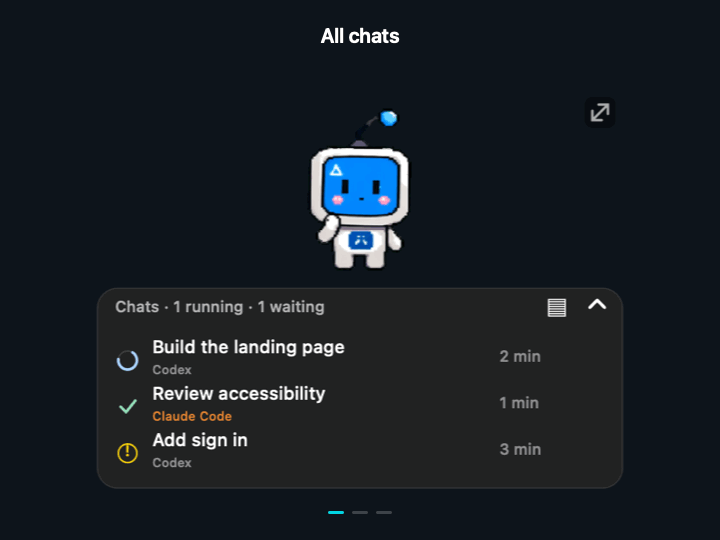
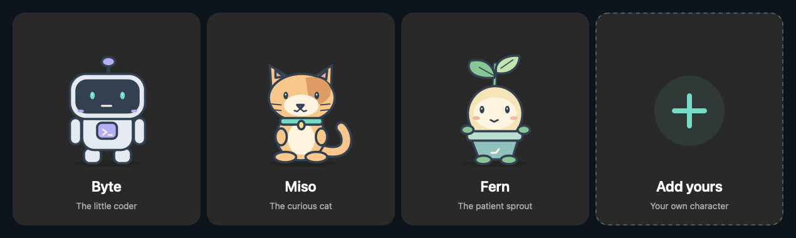

# Agent Pet

**Your AI agents, at a glance.**

A desktop companion that shows who’s working, who needs you and what’s done. 
Keep coding. Come back when your agents need a hand.

**Codex · Claude Code · Google Antigravity**

[**Install for VS Code**](https://marketplace.visualstudio.com/items?itemName=merttalhayener.agent-pet) · [Download VSIX](https://github.com/merttalhayener/agent-pet/releases/latest) · [Türkçe](README.tr.md)

Apple Silicon · macOS 26+ · VS Code 1.96.2+ · English / Türkçe

Demo with sample conversations.

## Keep your agents in view

Running agents across several projects? Agent Pet keeps their chats together in a floating panel above your other apps.

- **See what needs you.** Running, waiting and completed chats, with separate work and reply-waiting timers.
- **Go straight to the conversation.** Click a chat to open its VS Code window or terminal. **Ctrl + Option + Cmd + N** takes you to the next chat needing a reply.
- **Keep projects organized.** Chats are grouped by workspace by default. Collapse projects and filter for the work you want to follow.
- **Know when to come back.** Enable reply notifications, or watch the running and waiting counts in your menu bar.
- **Fit your workspace.** Move and resize the panel, change its appearance or use it without a pet. **Ctrl + Option + Cmd + P** hides everything for screen sharing.

## Make it yours

Choose **Byte**, **Miso** or **Fern**—or bring your own character.

Open **Pets → Add custom pet…**, give it a name and choose a PNG. Add optional poses for running, waiting, celebrating and sleeping. Preview the poses, adjust the size, flip the character and choose whether it moves.

Your pets and preferences stay with you through restarts and updates. [Create your first custom pet →](docs/usage.md#custom-pets)

## Get started

1. [Install Agent Pet](https://marketplace.visualstudio.com/items?itemName=merttalhayener.agent-pet) in VS Code.
2. Open your coding agent and sign in.
3. Follow the setup guide, or run **Agent Pet: Get Started** from the Command Palette.

Works with **Codex** and **Claude Code** in VS Code extensions and integrated terminals, plus the official **Google Antigravity VS Code extension**. Enable Agent Pet in each window you want to follow. [Supported setups & help →](docs/usage.md)

**Local and free.** No Agent Pet account or API key needed. Agent Pet keeps activity data and pet images on your Mac. No added telemetry. Open source under the [MIT license](LICENSE).

---

[User guide](docs/usage.md) · [What’s new](CHANGELOG.md) · [Report a bug / request a feature](https://github.com/merttalhayener/agent-pet/issues) · [Build from source](docs/development.md)

Agent Pet is an independent community project. User-supplied pet images retain their own licenses.
