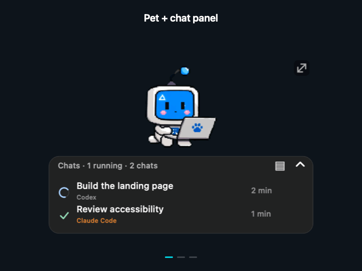

# Agent Pet

**Know which AI chat needs you.**

Codex, Claude Code and Google Antigravity across your VS Code windows. 
One floating macOS panel shows who’s working, who needs a reply and what’s finished. 
Click a chat to return to its window or integrated terminal. Add your own pet to make it yours.

[**Install from the Marketplace**](https://marketplace.visualstudio.com/items?itemName=merttalhayener.agent-pet) · [Türkçe](README.tr.md) · [What’s new](CHANGELOG.md)

macOS 26+ · Apple Silicon · VS Code 1.96.2+ · English / Türkçe

When agents are working in several projects, checking every window interrupts your flow. Agent Pet keeps their chats visible above your other apps, so you can spot a question, check progress and return to the right conversation in one click.

## What you get

- **Three agents, one panel.** Follow Codex, Claude Code and the official Google Antigravity VS Code extension across connected windows. Codex and Claude Code also work in VS Code’s integrated terminals.
- **Status you can act on.** See running, waiting and completed chats with separate turn and reply-waiting timers. Hover for the reason behind a status; unavailable activity is shown as unknown.
- **Go straight to the chat.** Click a row to open its conversation or reveal its terminal. **Ctrl + Option + Cmd + N** cycles through chats needing your reply, oldest wait first.
- **Keep projects organized.** Group chats by workspace, collapse projects and filter to running chats or those waiting for you. Assign a workspace when automatic matching needs correcting.
- **Catch requests for input.** Optional waiting notifications open the relevant chat when clicked. The menu bar counter keeps running and waiting totals visible while the panel is hidden.
- **Bring your own companion.** Choose Byte, Miso or Fern, or import your own PNG poses. Customize your pet’s name, size, direction and movement—or use the panel without a pet.
- **Stay in control.** Move and resize the panel, adjust its text and opacity, and hide everything for screen sharing with **Ctrl + Option + Cmd + P**. Your preferences survive restart.

## See progress and waiting time separately

Each conversation has its own status and timer. A completed turn gets a checkmark; a chat waiting for input shows how long its oldest unanswered request has been waiting.

Codex can ask a question while continuing to work. Agent Pet keeps its running spinner and shows **Running · question pending**. The next-chat shortcut includes these questions too. Reconnecting, unreadable records and disconnected windows have their own explanations; silence alone does not mark a chat completed.

Enable **Notifications → Notify when waiting for me** for reply alerts. They are off by default. Mute an individual chat from its right-click menu. [Status, notifications and navigation](docs/usage.md#reply-time-and-next-waiting-chat).

## Make it your pet

Choose **Pets → Add custom pet…**, or run **Agent Pet: Add Custom Pet** in VS Code. Give it a name and a normal PNG. Running, waiting, happy and sleeping poses are optional; missing poses use the normal image with a status badge.

Preview every pose, adjust size, flip horizontally and turn gentle movement on or off. Images are copied locally and remain available after restarts and extension updates. Use **Pets → Edit custom pet…** to change or delete the selected custom pet.

Static PNGs up to **10 MB** and **4096 × 4096 pixels** per pose are supported. Use transparent backgrounds and matching canvas sizes for consistent alignment. [Custom pet guide](docs/usage.md#custom-pets).

Prefer just the dashboard? **Hide pet** keeps the chat list visible. **Hide panel** leaves only the character; **Hide all** hides both.

*Animations show sample conversations rendered by the app.*

## Supported setups

| Agent | VS Code extension | VS Code integrated terminal |
| --- | --- | --- |
| Codex | Supported | Codex CLI |
| Claude Code | Supported | Claude Code CLI |
| Google Antigravity | Official VS Code extension | Not supported |

Clicking an extension chat opens the conversation in its owning window. Clicking a terminal chat reveals the terminal running it, even if the agent changed folders. Its row remains while that terminal is open.

For Antigravity, open its VS Code panel once to start the local backend. Questions and approval requests participate in waiting time, notifications and next-chat navigation. Nested subagents do not create duplicate rows. The standalone Antigravity app, Antigravity IDE, CLI and remote backends are outside this integration’s scope. [Antigravity setup and details](docs/usage.md#google-antigravity).

Agent Pet follows agents inside connected VS Code windows. Other terminal apps and cloud-only sessions are not tracked. Every window you want to follow needs the extension enabled. Some agent permission dialogs are not recorded and cannot trigger an alert. [Usage and current limits](docs/usage.md).

## Get started

1. Install **Codex**, **Claude Code** or **Google Antigravity** in VS Code and sign in to your agent. For Codex or Claude Code CLI, launch it in VS Code’s integrated terminal.
2. Install [Agent Pet from the Marketplace](https://marketplace.visualstudio.com/items?itemName=merttalhayener.agent-pet), or search `@id:merttalhayener.agent-pet` in Extensions.
3. Follow the **Get Started** guide. It checks your agents, opens the panel and offers to enable waiting notifications. Reopen it anytime with **Agent Pet: Get Started**.

The desktop companion ships with the extension. No separate Agent Pet account, API key, hook or wrapper is required. VS Code must remain open for live status. Extension updates arrive through VS Code; automatic reloads wait for tracked work to finish and show a countdown with **Later**.

Requires **Apple Silicon, macOS 26+ and VS Code 1.96.2+**. Windows, Linux and Intel Mac desktop helpers are not included. [Installation, updates and removal](docs/usage.md#install-update--remove).

## Quick controls

Right-click the pet or panel, or use the paw in the macOS menu bar.

| Action | Control |
| --- | --- |
| Open a chat or its terminal | Click its row |
| Open the next chat needing a reply | **Ctrl + Option + Cmd + N** |
| Group chats by workspace | **▤** in the panel header |
| Filter chats | **Filters → Running / Waiting for me** |
| Enable waiting notifications | **Notifications → Notify when waiting for me** |
| Add your own pet | **Pets → Add custom pet…** |
| Move or resize | Drag the pet or panel header / the top-right handle |
| Change text size, pet size or opacity | **Appearance** |
| Hide the pet or chat list | **Hide pet / Hide panel** |
| Hide or restore everything | **Ctrl + Option + Cmd + P** |
| Restore the panel from VS Code | **Agent Pet** in the status bar |
| Change language | **Language → English / Türkçe** |

## Local by design

Agent Pet reads local activity records and Antigravity’s local status stream. It does not upload conversation text or pet images, and adds no telemetry. Waiting notifications require macOS permission.

Open **Connections & diagnostics** in the paw menu, or run **Agent Pet: Connections**, to see which windows are connected. Its copyable report omits conversation text, titles, project names and file paths. You decide where to share it.

[Usage & troubleshooting](docs/usage.md) · [Build from source](docs/development.md) · [Release notes](CHANGELOG.md) · [Report an issue](https://github.com/merttalhayener/agent-pet/issues)

## License

Original source code, Byte, Miso, Fern and the application icon are [MIT licensed](LICENSE). User-supplied pet images retain their own licenses and are not bundled with Agent Pet. Codex, Claude Code and Google Antigravity names identify supported integrations; Agent Pet is an independent community project.
