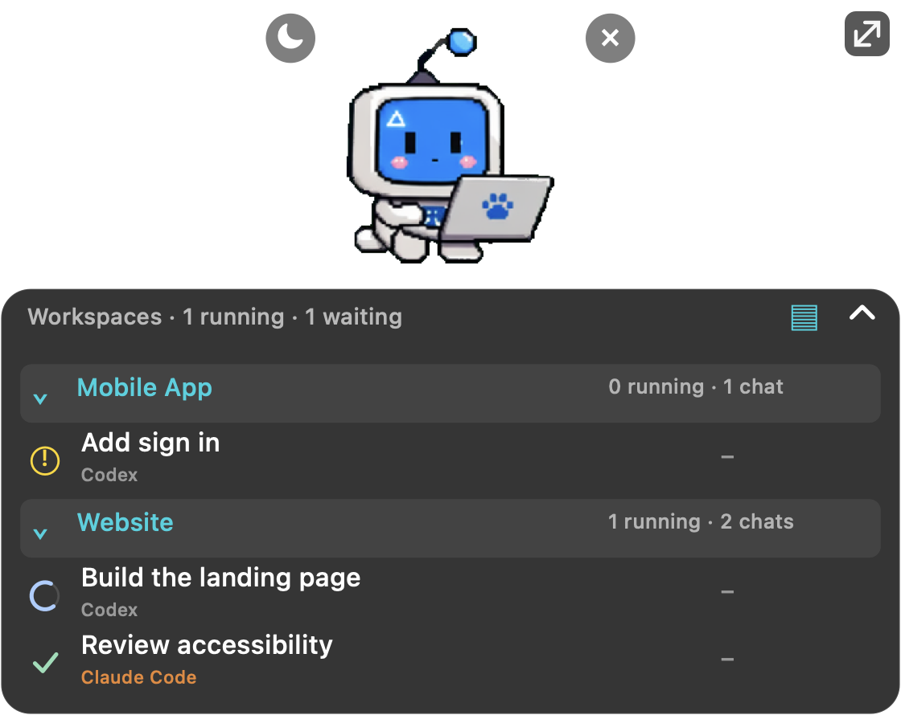

# Agent Pet

**Kodlama ajanların bir bakışta.**

Hangi sohbet çalışıyor, hangisi bitti, hangisi seni bekliyor? Masaüstündeki petten takip et.

**[macOS için indir](https://github.com/merttalhayener/agent-pet/releases/tag/v0.8.1)** · [English](README.md) · [Sürüm notları](CHANGELOG.md)

## Tek pet. Takip ettiğin sohbetler bir arada.

Başka uygulamada çalışırken yerel sohbetlerini takip et. Satıra tıklayıp VS Code'daki sohbete dön. Biten sohbetler sen kaldırana kadar listede kalsın. Her satırda **Codex** veya **Claude Code** etiketi görünür.

| Durumu gör | Kendine göre ayarla | Odaklan |
| --- | --- | --- |
| 🔵 Çalışıyor · ✅ Bitti · 🟡 Yanıt bekliyor | Pet, boyut, yazı ve saydamlık seçimi | Listeyi daraltma ve sohbet sabitleme |
| Her çalışma için geçen süre | Serbest taşıma ve kenara hizalama | Bitiş animasyonu ve isteğe bağlı ses |

<table>
<tr>
<td align="center" width="50%"><strong>Az yer kaplasın</strong>  </td>
<td align="center" width="50%"><strong>Seni bekleyeni fark et</strong>  </td>
</tr>
</table>

**Sunum veya ekran paylaşımı mı var?** **Ctrl + Option + Cmd + P** ile peti gizle ve bildirimlerini sessize al. Aynı kısayolla ya da menü çubuğundaki pati simgesinden geri aç.

## Neler destekleniyor?

| | Şu an |
| --- | --- |
| **İşletim sistemi** | Apple Silicon üzerinde macOS 26+ |
| **Ajanlar** | VS Code içindeki Codex ve Claude Code |
| **Yalnızca CLI / bulut oturumları** | Bu sürümde desteklenmiyor |
| **Diğer platformlar** | Henüz desteklenmiyor |

**Varsayılan arayüz dili İngilizcedir; Türkçe de desteklenir.** Canlı güncellemeler için VS Code açık kalmalıdır. Agent Pet bağımsız bir topluluk projesidir.

Claude Code desteği yerel VS Code oturumlarını otomatik okur; hook veya API anahtarı ayarı gerekmez. Claude satırına tıklamak aynı sohbeti sağ panelde açar. Tamamlanmış editör sekmesi otomatik taşınabilir; çalışan bir editör sekmesini ise iş bittikten sonra kapatıp petten tekrar aç.

## Kurulum

1. VS Code'a **Codex**, **Claude Code** veya ikisini birden kur ve giriş yap. Codex zorunlu değil.
2. [**agent-pet-0.8.1.vsix** dosyasını indir](https://github.com/merttalhayener/agent-pet/releases/download/v0.8.1/agent-pet-0.8.1.vsix).
3. VS Code'da **Extensions → ⋯ → Install from VSIX…** yolundan dosyayı seç.
4. Komut paletinden **Agent Pet: Show Desktop Pet** çalıştır.

**Satıra tıkla:** Sohbeti aç. **Peti sürükle:** Taşı. **↗↙ tutamacını çek:** Boyutlandır. **Sağ tıkla:** Ayarları aç. Listenin başlığındaki okla daralt veya genişlet.

### Dil seçimi

Pati menüsünden veya pete sağ tıklayarak **Language → Türkçe** seç. İngilizceye dönmek için **Dil → English** yolunu kullan. Değişiklik anında uygulanır ve yeniden açıldığında korunur. Önceki sürümden güncelleyenler için de ilk dil İngilizcedir. Sohbet başlıkları özgün haliyle kalır.

### Peti kapattın mı?

VS Code'un alt durum çubuğundaki **Agent Pet** düğmesine tıkla. Alternatif olarak **Cmd + Shift + P** ile **Agent Pet: Show Desktop Pet** komutunu çalıştır.

Peti kapatınca macOS menü çubuğundaki pati kalır: **Show pet / Peti göster** seçeneğini veya **Ctrl + Option + Cmd + P** kısayolunu kullan. Yardımcı uygulama tamamen kapandıysa VS Code'daki düğme ya da komut yeniden başlatır.

### Reload sonrası sohbet takılmış mı görünüyor?

Yeniden bağlanılan sohbet, yeni bir etkinlik kaydı gelene kadar çalışıyor sayılmaz. 60 saniye ilerleme kaydı gelmezse halka **No update / Güncelleme yok** durumuna döner. Sohbet listede kalır; yeni etkinlik gelince otomatik güncellenir. Tik yalnızca açık bir tamamlanma kaydıyla gösterilir. Listede tutulan eski sohbetler yeniden kontrol edilir; tamamlanma kaydı varsa `?` olarak kalmaz.

Pet yerel ajan etkinliğini takip eder; ajanın sohbet ekranına mesaj ulaşıp ulaşmadığını göremez. Uzun süren sessiz bir işlem de “Güncelleme yok” gösterebilir.

Eski sürümden güncelliyorsan VS Code'u bir kez yeniden yükle; eski yan paneldeki **Pet** bölümü kalkar. Masaüstü petinin ayarları korunur.

<strong>Beta notları ve yerel veriler</strong>

- Açık çalışma alanındaki yakın tarihli yerel sohbetleri takip eder; tüm açık sekmeleri veya bulut sohbetlerini listelemez.
- Yanıt bekleyen sorular yerel kayıtlardan algılanır; bazı izin pencereleri algılanamaz.
- Eklenti telemetri eklemez, sohbet kayıtlarını sunucuya göndermez. Dahili robot Codex olmadan çalışır. Ek karakter görselleri kurulu Codex eklentisinden okunur.
- Developer ID imzası/notarizasyonu ve genel bir açık kaynak lisansı henüz sağlanmıyor.

**[Derleme ve teknik ayrıntılar](docs/development.md)** · **[Sorun bildir](https://github.com/merttalhayener/agent-pet/issues)**

Güncellerken aktif işler bittikten sonra bir kez **Developer: Reload Window** çalıştır. Yeni sohbet yönlendirmesi yüklenir, masaüstü yardımcısı otomatik güncellenir; tercihlerin korunur.

### Çalışma alanları

Listedeki **▤** düğmesi veya **Görünüm → Genişletilmiş · Çalışma alanları** ile sohbetleri VS Code çalışma alanına göre grupla. Sohbete tıklayınca ilgili çalışma alanının açık VS Code penceresine dön. Grup başlığına tıklayarak açıp kapat; çalışan ve toplam sohbet sayısını başlıkta gör. Codex ve Claude sohbetleri aynı çalışma alanının altında kalır.

Çok klasörlü `.code-workspace` dosyaları tek grup olur. Görünüm ve grup tercihlerin yeniden açınca korunur. Çalışma alanı bilgisi olmayan eski kayıtlar, ilgili pencere tekrar bildirene kadar **Diğer sohbetler** altında kalır. **Görünüm → Kompakt liste** ile eski görünüme dönebilirsin. Güncellemeden sonra aktif işler bitince açık çalışma alanı pencerelerinde bir kez **Developer: Reload Window** çalıştır.
