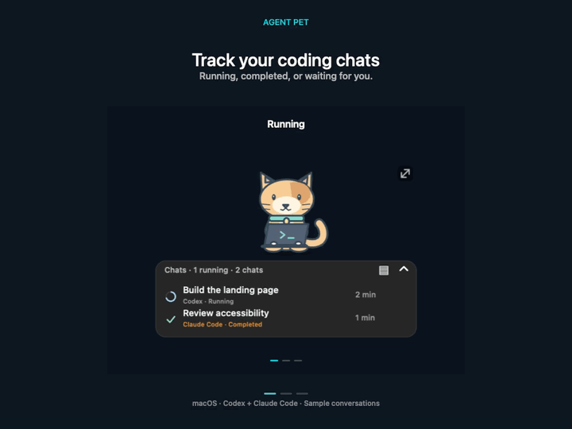

# Agent Pet

**Kodlama sohbetlerin bir bakışta.**

VS Code’daki **Codex ve Claude Code** sohbetleri için masaüstü yardımcısı. 
Başka uygulamadayken de hangi sohbet çalışıyor, hangisi bitti, hangisi seni bekliyor gör.

**macOS 26+ · Apple Silicon · English / Türkçe · Beta**

[**İndir**](https://github.com/merttalhayener/agent-pet/releases/tag/v0.9.1) · [English](README.md) · [Sürüm notları](CHANGELOG.md)

12 saniyelik animasyonlu önizleme · [MP4 indir](https://raw.githubusercontent.com/merttalhayener/agent-pet/main/docs/media/demo.mp4)

## Neler yapabilirsin?

- **Sohbetleri takip et:** çalışıyor, tamamlandı ve yanıt bekliyor durumları; geçen süre.
- **Çalışma alanına göre grupla:** projeleri ayır, sohbeti kendi VS Code penceresinde aç.
- **Yalnızca paneli kullan:** sohbetleri gizlemeden pet görselini kaldır.
- **Kendine göre ayarla:** boyut, saydamlık, karakter seçimi ve sohbet sabitleme.

**Yerel VS Code oturumları** desteklenir. Yalnızca CLI veya bulut oturumları desteklenmez. Canlı güncellemeler için VS Code açık kalmalıdır. API anahtarı veya hook ayarı gerekmez.

## Kurulum

1. VS Code’a **Codex**, **Claude Code** veya ikisini birden kur ve giriş yap.
2. [VSIX dosyasını indir](https://github.com/merttalhayener/agent-pet/releases/download/v0.9.1/agent-pet-0.9.1.vsix), **Extensions → ⋯ → Install from VSIX…** ile kur.
3. Komut paletinden **Agent Pet: Show Desktop Pet** çalıştır.

Güncellerken aktif işler bittikten sonra her açık VS Code penceresinde **Developer: Reload Window** çalıştır.

## Hızlı kullanım

| Ne yapmak istiyorsun? | Nasıl? |
| --- | --- |
| Pet görselini gizle | **Görünüm → Yalnızca panel** |
| Sohbetleri grupla | **▤** veya **Görünüm → Genişletilmiş · Çalışma alanları** |
| Taşı / boyutlandır | Peti veya panel başlığını / sağ üst tutamacı sürükle |
| Tamamen gizle veya geri getir | **Ctrl + Option + Cmd + P** ya da pati menüsü |
| Yeniden aç / dili değiştir | VS Code’daki **Agent Pet** düğmesi / **Language → Türkçe** |

Ayarlar için pete veya panele sağ tıkla. Tercihlerin kaydedilir.

Bağımsız topluluk projesi. Telemetri eklemez; sohbet kayıtları yerel kalır.

[Kullanım ve sorun giderme (EN)](docs/usage.md) · [Derleme ve teknik ayrıntılar (EN)](docs/development.md) · [Sorun bildir](https://github.com/merttalhayener/agent-pet/issues)
